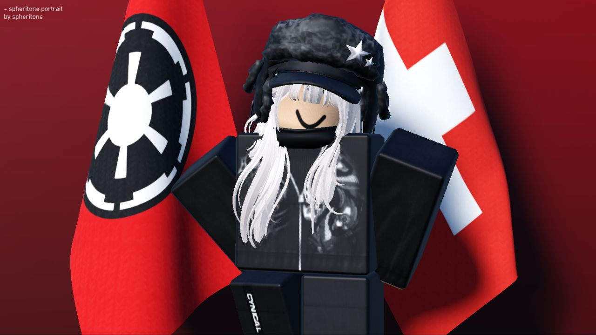

	
	
	

- [spheritone Roblox](https://www.roblox.com/users/5844980816/profile) -

# About me!
- Hello there, I am zetev0l and I'm currently a Senior Highschooler. I code in Roblox Lua 5.4 and mess around in roblox studio. 
- I also touch a bit on graphics design, skills enough for me to make cool icons (I use paint.net btw). Portraitures above not related.
- Coding isn't mainly my hobby but its my last resort hobby prior to playing boring games.
- English isn't my primary language.
- I like cats and snow :3

- Currently taking Original Science subjects, and as far as I'm getting... It's pretty good.

# Join date..
- I joined Github back circa-2021 when I was 13 and left my account untouched for like 3.5 years. That's because I don't even understand what the hell is Github even and moved on to something else.
- Returning back to Github this year because I saw people using it for their code projects. So, why don't I.

# Qn'A :
### Sooo.. Where are my repositories?
- Keeping them privated for my future references if any.
- I won't any give off any read/edit access to anyone.
### Do you have a Roblox account?
- You can follow me on [@spheritone](https://www.roblox.com/users/5844980816/profile) Roblox.
### Where do I live?
- I live in the southeast Asia region (SEA).
### How do can I be reached out?
- Keeping myself private for this one. So, not open.

---

<h4 align = "center">pretty basic profile readme ngl</h4>
<h5 align = 'center'> Apologies for any phrasings that sound weird, I tried my best. 😞</h5>
<h6 align = 'center'> btw I use Obsidian to edit my .md files </h6>
